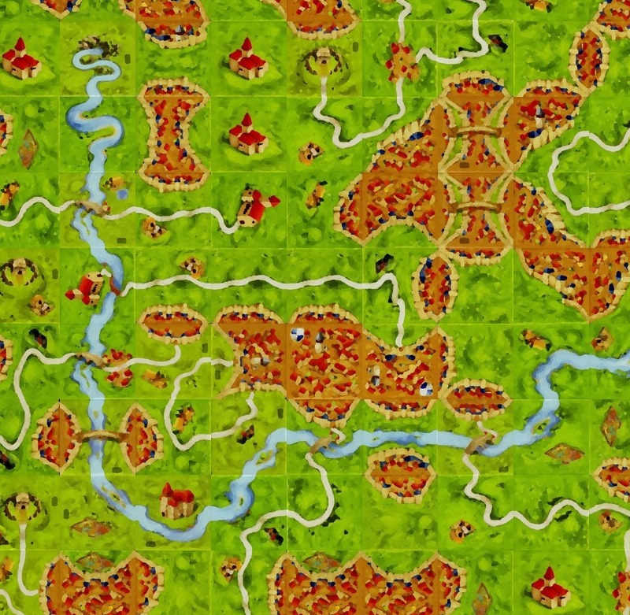

Carcassonne Map Generator
=========================


[](./LICENSE)

A tool that generates a randomized Carcassonne map!

## Usage

Most simple example:
```
./carcassonne.py resources/tileset_base.json
```

A more elaborate example with the river tileset used a single time, excluding the T river tile, and with a total of 800 tiles (the base tileset is reused:)
```
./carcassonne.py -n 800 --river-policy EXCLUDE_T --river-period 0 --zoom 0.5
                 resources/tileset_base.json resources/tileset_river.json
```

## Requirements

* __Python 3.x__: http://www.python.org/download/
* __pygame__: https://www.pygame.org/

```
pip install -r requirements.txt
```

## Unit Tests

```
python -m unittest -v
```

## Screenshot


