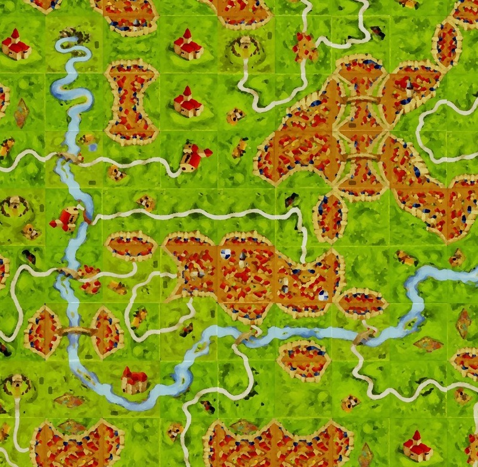

Carcassonne Map Generator
=========================


[](./LICENSE)

A tool that generates a randomized Carcassonne map!

## Usage

Most simple example:

```
python carcassonne.py resources/tileset_base.json
```

A more elaborate example with the river tileset used a single time, excluding the T river tile, and with a total of 800 tiles (the base tileset is reused:)

```
python carcassonne.py -n 800 --river-policy EXCLUDE_T --river-period 0 --zoom 0.5 resources/tileset_base.json resources/tileset_river.json
```

## UI Controls

* Press 'F11' or 'F' to toggle fullscreen
* Press the arrow keys to pan
* Press 'PAGE_UP' and 'PAGE_DOWN' to zoom in and out
* Press 'R' to reset the view to its initial state
* Press 'ESCAPE' in the graphics window to quit

## Requirements

* __Python 3.x__: http://www.python.org/download/
* __pygame__: https://www.pygame.org/

Create a venv with the required packages:

```
python -m venv venv
source venv/Scripts/activate
python -m pip install -r requirements.txt
```

## Unit Tests

```
python -m unittest -v
```

## Screenshot


